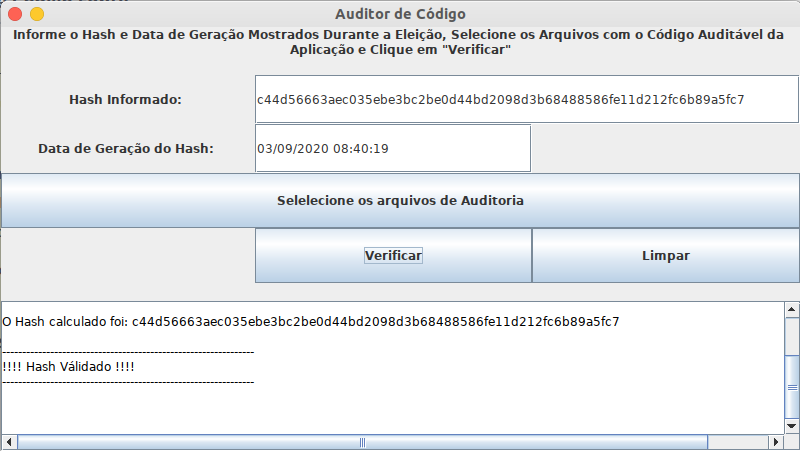

# AuditorCodigoFonte

Projeto para auditor o código do sistema XXXX

### Tecnologias e Ferramentas Utilizadas
  * Java: OpenJDK 11
  * Ferramenta de Build: Gradle v6.4.1;
  * IDEs Recomendadas: Intellij Community Edition
  
### Dependências de Infraestrutura

  * Não há

### Execução do Sistema
  
  * Baixe o arquivo **libs/AuditorCodigoFonte-X.Y.Z.jar**
  
  * Execute o comando: 
  
        java -jar AuditorCodigoFonte-X.Y.Z.jar
  
  * Mais instruções sobre a execução do projeto em  **docs/guia de implantação Auditor de Código.pdf**

## Autores Principais
 
  * **Jadson Santos** - [jadson@info.ufrn.br](mailto:jadson@info.ufrn.br)